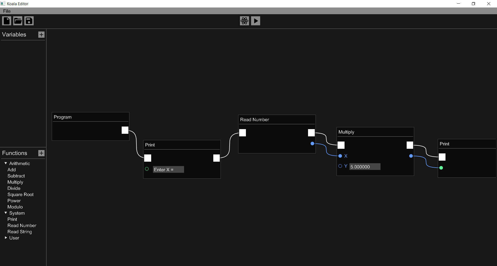

.. include:: /../../README.rst
	:end-before: relative_image_path

.. end_of_readme

Development Notes
-----------------

This section describes the structure of the Koala project and fundamental needs. It also explains some of the rules that applied throughout the project.

Architecture
************

Koala project is divided into 4 modules:
	
	- **Editor**: This is the core tool of Koala. It is a GUI program that lets users to create programs. Other modules can be used through GUI elements to compile and run the created program.
	
	- **Compiler**: This is a console application. It compiles project files produced by the editor to bytecodes.
	
	- **Virtual Machine**: This is a console application. It enables computer to run a Koala program by interpreting its bytecodes.
	
	- **Utility**: This is a library that implements common functionality for other modules.

More information about each module can be found on :ref:`Koala API Documentation <table_of_contents>`.

Coding Standards
****************

Some coding conventions are used throughout the project. You can find these conventions at :doc:`here<CodingStandards>`.

Platform
********

Main target of Koala is x86 Windows. But the intent is to keep the project cross-platform. Because of this, platform dependent operations are always abstracted and a compiler error is left for other possible platforms. Hardware related differences (endianness, etc.) are also taken into account as much as possible to support wide range of platforms.

Build
*****

All of the modules are being developed with C++ using Visual Studio 2017. Every module is a separate project under same solution. The editor uses several third party tools:
	
	- `GLEW <http://glew.sourceforge.net/>`_
	- `GLFW <http://www.glfw.org/>`_
	- `Dear ImGui <https://github.com/ocornut/imgui>`_
	- `stb_image <https://github.com/nothings/stb>`_

Everything needed to compile the project under Windows is provided in the project folder.

.. _table_of_contents:

.. toctree::
	*
	:hidden:
	:glob:
	:caption: General

.. toctree::
	*[!Utility]/index
	Utility/index
	:glob:
	:caption: API Documentation
